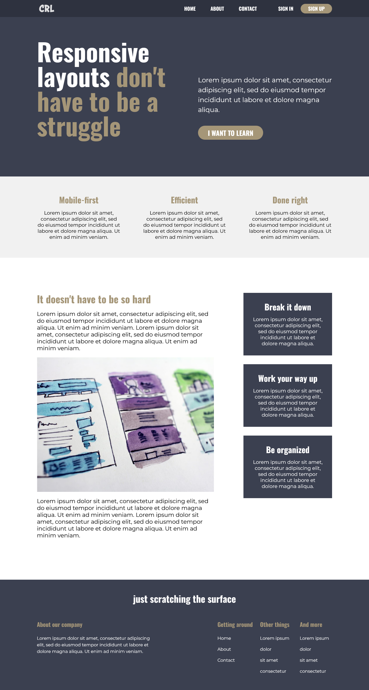

# Responsive Layouts Final Challenge

This is a solution to the final challenge from [Kevin Powell's course Conquering Responsive Layouts](https://courses.kevinpowell.co/conquering-responsive-layouts).

## Table of contents

- [Overview](#overview)
  - [The challenge](#the-challenge)
  - [Screenshot](#screenshot)
  - [Links](#links)
- [My process](#my-process)
  - [Built with](#built-with)
  - [What I learned](#what-i-learned)
  - [Continued development](#continued-development)
  - [Useful resources](#useful-resources)

## Overview

### The challenge

Users should be able to:

- View the optimal layout for the interface depending on their device's screen size
- See hover and focus states for all interactive elements on the page
- Use the hamburger icon to open the menu on smaller screens

### Screenshot

### Links

- [View Code](https://github.com/elizerdim/responsive-layouts-final-challenge)
- [Live Preview](https://elizerdim.github.io/responsive-layouts-final-challenge/)

## My process

### Built with

- Semantic HTML5 markup
- CSS3
- Flexbox
- CSS Grid
- JavaScript
- Mobile-first workflow

### What I learned

- I did some further research and got a firmer grasp of semantic HTML at the beginning of the project.

- I learned about the principles of mobile-first approach to responsive design and applied them in this project. A full design for mobile screens was not provided, so I had to think about how to adapt the desktop styles to mobile screens, as Kevin suggests in the course when only desktop design is provided. 

- The hamburger icon for menu toggle in mobile screens was a bit of a challenge. I used a little bit of JavaScript for it, but more importantly, I learned a lot more about CSS animations, for example, how to use them with changing positions to make the middle line look like it fades away. 

- I had plenty of opportunity to practice Flexbox and some Grid in this project, which gave me a better understanding of both layout models. 

- Learning how to use Git with GitHub was the reason it took me a lot longer than I expected to finish this project because I am so used to practicing locally, but now I feel much more comfortable using Git during development.

### Continued development

I want to get more comfortable with mobile-first approach and get more practice with CSS animations for micro-animations such as the hamburger button I made in this project.

### Useful resources

- [Animated hamburger icons](https://codepen.io/designcouch/pen/ExvwPY) - These examples helped me a lot with the hamburger icon animation. I spent significant time examining the code for each one and adapted the first one to my project. I will probably refer back to this resource in other projects.
- [<article> vs. <section>](https://www.smashingmagazine.com/2022/07/article-section-elements-accessibility/) - This is an amazing article which helped me understand the difference between <article> and <section> elements. 